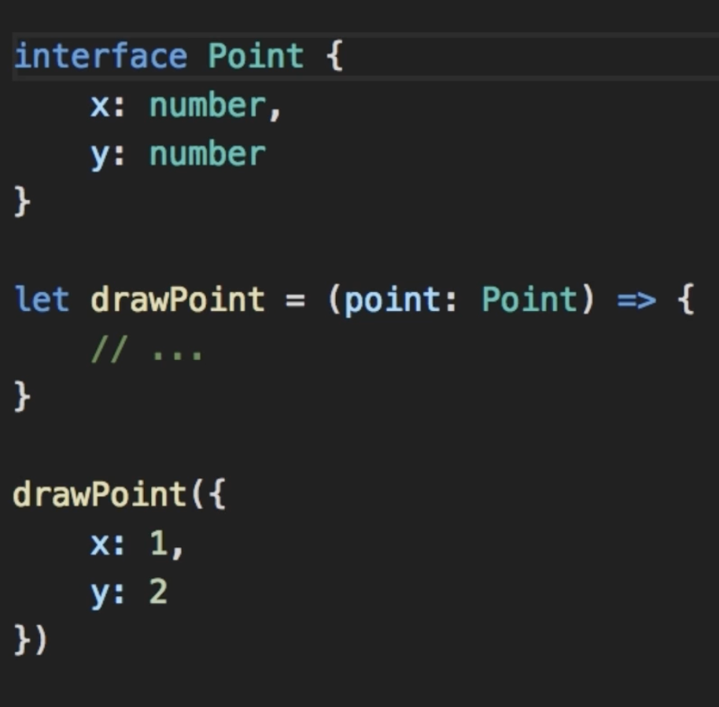

<div align="center">

#  LEARNING ANGULAR 

This repository contains notes and learnings from my journey into Angular, broken down into logical, easy-to-understand sections.

[](https://github.com/bhaumikmaan/learning-angular "Go to GitHub repo")
&nbsp; [](https://github.com/bhaumikmaan/learning-angular)
&nbsp; [](https://github.com/bhaumikmaan/learning-angular)
&nbsp; [](#license)
<br/>

[//]: # (<a href="https://medium.com/@bhaumikmaan/your-angular-blog-post-link-here" target="_blank">)

[//]: # (  )

[//]: # (</a>)

[//]: # (&nbsp;)

[//]: # (<a href="https://github.com/bhaumikmaan/learning-angular/stargazers" target="_blank">)

[//]: # (  )

[//]: # (</a>)
</div>

<hr style="height:10px">

## Building Modern Web Apps: My Journey with Angular 🚀

In the rapidly evolving landscape of web development, building robust, scalable, and maintainable client-side applications is paramount. My recent deep dive into Angular has been an illuminating experience, revealing its power as a comprehensive framework. If you've ever sought a structured approach to front-end development that goes beyond traditional JavaScript or jQuery, Angular offers a compelling solution. This post consolidates my key learnings, highlighting the core concepts and architectural principles that make Angular a go-to choice for many developers. Let's explore the world of Angular!

<hr style="height:10px">

## Understanding Angular: The Foundation 🏗️

Angular is a powerful, opinionated framework designed for building sophisticated client-side applications using HTML, CSS, and JavaScript/TypeScript. It evolved significantly from its predecessor:

* **AngularJS (Version 1.x):** The original version, built primarily with JavaScript.
* **Angular (Version 2+):** A complete rewrite from the ground up, leveraging TypeScript as its primary language. This shift brought significant improvements in performance, structure, and developer experience.

One of Angular's core strengths lies in addressing the challenges of traditional front-end development. Vanilla JavaScript or jQuery codebases can quickly become unwieldy, difficult to manage, and nearly impossible to test in larger applications. Angular provides a structured solution by:

* Imposing a **clean application structure**.
* Encouraging **reusable code** through its component-based architecture.
* Offering **excellent support for testing frameworks**, making applications robust and reliable.

### Application Architecture Overview

An Angular application typically integrates within a client-server architecture:

* **Frontend (Client):**
  * This is where your Angular application resides.
  * It primarily contains the User Interface (UI) logic.
  * It is responsible for triggering API calls to the backend to fetch or send data as needed.
* **Backend (Server):**
  * This part handles data storage, complex processing, and business logic.
  * It exposes API endpoints that the frontend consumes to interact with data.

### Packaging and Development Experience

Angular applications are efficiently delivered through **web packs**. These web packs bundle your application's code into smaller, optimized JavaScript files. This modular approach ensures faster loading times and better performance by separating code for:

* **Styles:** CSS bundles.
* **Inline:** Small, critical inline scripts.
* **Vendor:** Third-party libraries and dependencies.
* And other specific code segments.


* A standout feature for developers is **Hot Module Replacement/Reloading**. 
  * Whenever you modify your source code, the web pack automatically detects the changes and instantly refreshes the browser. 
  * This provides an almost instantaneous feedback loop, drastically improving development speed and efficiency.

<hr style="height:10px">

## Diving Deeper: Mastering TypeScript 🚀

TypeScript (TS) is a cornerstone of modern Angular development. It's a superset of JavaScript, meaning it includes all JavaScript features while adding powerful capabilities that enhance code quality and developer productivity.

* **Strongly/Statically Typed:**
  * One of TypeScript's most significant advantages is its strong and static typing.
  * You can explicitly define data types for variables, function parameters, and return values.
  * This allows for **errors to be caught at compile time**, rather than at runtime, leading to more robust and predictable applications.
* **Object-Oriented Features:**
  * TypeScript brings traditional object-oriented programming (OOP) concepts like classes, interfaces, and access modifiers directly to JavaScript development.
* **Transpilation:**
  * Browsers understand JavaScript, not TypeScript.
  * When you write TS code, it is **transpiled** (converted) into plain JavaScript.
  * This process happens automatically under the hood when you run commands like `ng serve`.
  * You can also manually transpile a TS file to JS using the TypeScript compiler: `tsc file_name.ts` converts to `file_name.js`.

### Variables in TypeScript

Understanding variable declarations in TypeScript often involves revisiting their JavaScript counterparts and appreciating the added scope control.

* **`var` (JavaScript):**
  * In traditional JavaScript, a variable declared with the `var` keyword is function-scoped.
  * This means its accessibility is limited to the nearest enclosing function, regardless of block boundaries.
* **`let` (TypeScript/ES6):**
  * The `let` keyword, introduced in ES6 (and widely used in TypeScript), provides **block-scope**.
  * This means the variable's scope is confined to the curly braces `{}` of the block where it's declared (e.g., within an `if` statement or a `for` loop).
  * It's important to note that when TypeScript (ES6) code containing `let` is transpiled to ES5 (for broader browser compatibility), the `let` keyword might be replaced with `var` in the resulting JavaScript. 
  * However, the TypeScript compiler ensures the original block-scoping intent is maintained during the compilation process.


### Types in TypeScript

TypeScript's type system is fundamental to its power, allowing you to clearly define the kind of data your variables will hold.

* **`number`:** Used for both integers and floating-point numbers.
* **`boolean`:** For `true` or `false` values.
* **`string`:** For storing text.
* **`any`:** A flexible type that can store any data type after its declaration. While useful for scenarios where the type is truly unknown, it should be used judiciously as it bypasses TypeScript's type-checking benefits.
* **`number[]`:** Denotes an array that specifically stores numbers (e.g., `string[]` for an array of strings).
* **`enum`:** Used to define a set of named constants. By default, these constants have auto-incrementing numerical values starting from 0.

### Type Assertion

* Similar to the concept of typecasting in other strongly-typed languages, **Type Assertion** in TypeScript allows you to explicitly tell the compiler about the type of a variable, especially when TypeScript might not be able to infer it automatically (e.g., for a variable initially declared as `any`).
* This helps you access type-specific methods and properties.

```typescript
let value: any = "hello world";
let len: number = (<string>value).length; // Type assertion
```


### Arrow Functions

Arrow functions provide a more concise syntax for writing function expressions. They are analogous to **lambda functions** in Java, allowing a function to be defined and used directly at runtime without requiring an explicit `function` keyword and formal declaration.

```typescript
// Traditional function
const add = function (a: number, b: number): number {
  return a + b;
};

// Arrow function
const addArrow = (a: number, b: number): number => a + b;
```


### Interfaces

Interfaces in TypeScript are crucial for defining **custom types**. They describe the shape that an object must have, specifying its properties and their types. This is similar to how interfaces work in Java. Conventionally, the first letter of an interface name is capitalized.

```typescript
interface Point {
  x: number;
  y: number;
}
```


### Classes

Classes in TypeScript are a core feature for implementing object-oriented programming principles. They allow you to group related variables (known as **properties**) and functions (known as **methods**) together, promoting the **cohesion principle**.

* For instance, instead of having a standalone function that takes an interface as a parameter, if that function's logic is intrinsically related to the interface's data, it's often more appropriate to make it a method of a class that encapsulates that data.
* A **Constructor function** is a special method within a class that is automatically called when a new object is created from that class. Its primary purpose is to set the initial values for the object's variables.
* Unlike languages like Java or C++, **constructor overloading is not directly possible** in TypeScript. Instead, you achieve similar flexibility by making parameters optional. If you make one parameter optional, all parameters to its right must also be made optional.


### Access Modifiers

TypeScript supports three types of access modifiers, controlling the visibility and accessibility of class members:

* **`public`:** This is the default access modifier. Members declared as `public` are accessible from anywhere, both within the class and from outside the class (e.g., from objects instantiated from the class).
* **`private`:** Members declared as `private` are only accessible from within the class where they are defined. They cannot be accessed from outside the class.
* **`protected`:** Members declared as `protected` are accessible within the class itself and by any derived classes (subclasses).

A convenient feature in TypeScript is that you can set an access modifier directly on the parameters within a class's constructor. This automatically declares and initializes the class properties, making your code less redundant by removing the need for separate property declarations and assignments within the constructor body.


### Properties (Getters and Setters)

Properties in TypeScript provide a controlled way to access and modify class variables, similar to the concept of getter and setter methods in Java. By using the `get` and `set` keywords, you can define functions that run when a property is read or written, respectively.

* This allows you to encapsulate logic, such as validation or transformation, when interacting with class data.
* A common convention is to prefix internal class variables (those directly holding the data) with an underscore (`_`) and then expose them via `get` and `set` properties with camel casing.


### Modules

In TypeScript, all code is organized into **modules**. Modules are essentially small, independent files that encapsulate related code. This modular approach helps in structuring large applications, improving maintainability, and promoting code reusability.

* To make code from one file available in another, you need to **explicitly `export`** the functions, classes, interfaces, or variables that you want to share.
* Conversely, you **`import`** these exported members into files where that functionality is required. TypeScript needs these explicit `export` and `import` statements to understand the dependencies between your modules.
* **Template Strings (Backticks ``):**
  * A useful feature for string manipulation is the use of backticks (`` ` ``) to define template strings.
  * This allows you to embed expressions and variables directly within a string using the `${}` syntax, simplifying string concatenation and logging.
  * **Example:** `console.log(`Count: ${object.count}`);`
  
<hr style="height:10px">

## Angular Fundamentals: Building Blocks of Your App 🧱

At the heart of every Angular application are a few core concepts that work together to create dynamic and interactive user interfaces. Understanding these fundamentals is key to building effective Angular apps.

### Components: The UI Building Blocks

The primary building block of an Angular application is a **Component**. Each component controls a specific part of the user interface (a "view") and encapsulates everything needed for that view:

* **HTML Template:** Defines the component's UI structure and layout.
* **Logic (TypeScript Class):** Contains the data, properties, and methods that control the behavior of the template.
* **Styles (CSS/SCSS):** Defines the styling for the component's view.

A component is essentially a TypeScript class decorated with `@Component()`. This **decorator** provides metadata that tells Angular how to process, instantiate, and use the component at runtime. This metadata includes the template, styles, and a `selector` (a custom HTML tag) that allows you to use the component within other templates.

For a component to be rendered in your application, it typically needs to be declared within an Angular **Module** (specifically, in the `declarations` array of an `@NgModule`). Once declared, you can use its `selector` in your `app.component.html` or other component templates to display it.


#### Creating Components with Angular CLI

The Angular Command Line Interface (CLI) simplifies component creation significantly:

* **`ng g c <name>`:** This command, where `g` stands for `generate` and `c` for `component`, automatically generates all the necessary files for a new component (e.g., `.ts`, `.html`, `.css`, `.spec.ts`).
* It also automatically updates the nearest Angular module's `declarations` array, making the new component ready for use.
* However, if you need to use this component in a different module or set up routing for it, you might still need to manually configure the routes or import it into the relevant module.

### Modules: Organizing Your Application

An Angular **Module** (defined by the `@NgModule()` decorator) acts as a container for a cohesive group of related components, services, directives, and pipes. They are essential for organizing code into logical blocks and defining their dependencies and visibility.

* Every Angular application has at least one root module, conventionally named `AppModule`. This module bootstraps the application and serves as the entry point.
* Modules help in lazy loading features, which means parts of your application are only loaded when they are needed, improving initial load times.

### Templates: Dynamic Views

Angular uses **templates** to render data dynamically to the user interface.

* **Interpolation `{{ value }}`:** This syntax allows you to display component property values directly in the HTML. It's a form of **one-way data binding** – any change to the `value` in the component's TypeScript class will automatically update the displayed content in the view.
* Templates are compiled and bundled with your source code, typically becoming part of the `main.bundle.js` file for efficient delivery to the browser.
* **Styling:** Angular offers various ways to apply styles (inline, component-specific, global). It's crucial to remember the CSS cascade: the style rule that is read last (or is most specific) will be applied, overriding previous definitions.

### Directives: Enhancing HTML Behavior

**Directives** are classes that add additional behavior to elements in your Angular applications. They allow you to manipulate the DOM (Document Object Model) by changing its structure, appearance, or behavior.

Angular provides several built-in directives for common tasks:

* **Structural Directives (`*`)**:
  * These directives modify the DOM layout by adding, removing, or manipulating elements.
  * They are easily recognizable by the asterisk (`*`) prefix (e.g., `*ngIf`, `*ngFor`).
  * The asterisk is syntactic sugar for a more complex underlying mechanism that Angular uses to create and manage `ng-template` elements, allowing dynamic changes to the DOM based on conditions or data iterations.
  * **Examples:**
    * `*ngIf`: Conditionally adds or removes elements from the DOM.
    * `*ngFor`: Renders a list of items based on a collection.
* **Attribute Directives (`[ ]`)**:
  * These directives change the appearance or behavior of an existing element, component, or another directive (e.g., `[ngClass]`, `[ngStyle]`, `ngModel`).
* **Component Directives**:
  * Components themselves are technically a type of directive, but with a template.

Directives are widely used to manage forms, render lists, apply dynamic styles, and control what users see based on application state.

### Services: Decoupling Logic and Data

* **Services** in Angular are plain TypeScript classes designed to encapsulate reusable logic and data access concerns. They are typically used for tasks such as:
  * Fetching data from a backend HTTP service or a database.
  * Sharing data and functionality across multiple components.
  * Handling business logic that doesn't directly relate to UI concerns.
* Unlike components, services do not have a specific Angular decorator like `@Component()`.
* Instead, when generated via the CLI, they are typically decorated with `@Injectable()`.
  * This decorator signals to Angular that the class can be **provided** and **injected** as a dependency into other classes (like components or other services).
  * This design promotes **decoupling**, making your application more modular, testable, and maintainable.
  * They are conceptually similar to "services" in frameworks like Spring Boot.

#### Creating Services with Angular CLI

* **`ng g s <name>`:** This command, where `g` is for `generate` and `s` for `service`, creates a new service file (e.g., `<name>.service.ts`).
* The `@Injectable()` decorator is automatically added, marking the service as a class that can participate in Angular's dependency injection system.

### Dependency Injection: Managing Dependencies

**Dependency Injection (DI)** is a core design pattern in Angular that allows you to provide instances of dependencies (like services) to classes that need them, rather than having the classes create those dependencies themselves. This promotes loose coupling and makes your code easier to test and manage.

* **Constructor Injection:**
  * The most common way to inject a dependency is by declaring it as a parameter in the constructor of the consuming class (e.g., a component or another service).
  * Instead of using the `new` keyword to create an instance, Angular's DI system provides an instance of the required service.
* **Providers:**
  * For Angular's DI system to know how to create and provide an instance of a service, you need to register it as a **provider**.
  * Services generated with `ng g s` often have `providedIn: 'root'` in their `@Injectable()` decorator. This makes the service a singleton available throughout the entire application.
  * Alternatively, you can provide a service at the module level (in the `providers` array of `@NgModule`) or even at the component level, creating a new instance for that specific module or component and its children.

Dependency Injection is fundamental to how Angular components and services interact, allowing for clean, testable, and scalable application architectures.


<hr style="height:10px">

## Data Display and Event Handling: Making Your UI Interactive ✨

Angular provides powerful mechanisms to bind data between your component's logic and its HTML template, enabling dynamic data display and responsive event handling.

### Property Binding: Component to View

**Property Binding** is a **one-way data binding** mechanism that allows you to set properties of HTML elements or directives dynamically based on values from your component's class.

* It is denoted by **square brackets `[]`** around the target HTML property.
* **Example:** `<input [value]="username">`
* In this example, the `value` property of the `input` element is bound to the `username` property of the component class. Whenever `username` changes in the component, the `value` attribute of the input field will automatically update to reflect that change in the view.

### Attribute Binding: Handling Special Cases

It's important to understand the distinction between HTML attributes and DOM properties. Not all HTML attributes directly translate to manipulable properties in the DOM's tree structure.

* For attributes that don't have a direct DOM property equivalent, you use **Attribute Binding**, denoted by prefixing the attribute with `attr.` (e.g., `[attr.aria-label]="labelValue"`). This explicitly tells Angular to bind to the HTML attribute rather than a DOM property.

### Class Binding: Dynamic Styling with Classes

**Class Binding** allows you to dynamically add or remove CSS classes from an HTML element based on the value of a component property.

* It is achieved using the `[class.your-class-name]="condition"` syntax or by binding to the entire `class` attribute with an object: `[class]="{'active': isActive, 'highlight': isHighlight}"`.
* This enables conditional styling, making it easy to visually represent changes in your application's state.

### Style Binding: Inline Style Control

**Style Binding** allows you to set inline CSS styles on an HTML element dynamically based on component properties.

* It is achieved using the `[style.property]="value"` syntax (e.g., `[style.color]="textColor"` or `[style.width.px]="itemWidth"`).
* You can also bind to the entire `style` attribute with an object: `[style]="{'background-color': bgColor, 'font-size': fontSizePx + 'px'}"`.

### Event Binding: View to Component Interaction

**Event Binding** is a **one-way data binding** mechanism that allows you to respond to user interactions or other events fired by HTML elements or directives. It binds a component method to an HTML element event.

* It is denoted by **parentheses `()`** around the target event name.
* **Example:** `<button (click)="onButtonClick()">Click me</button>`
* You can often access information about the event that occurred by passing a special `$event` variable as an argument to your component method (e.g., `(input)="onInputChange($event)"`).
* **Event Bubbling:**
  * By default, events in the DOM follow a process called **event bubbling**, where an event triggered on an inner element propagates upwards through its parent elements in the DOM tree.
  * This can lead to multiple event handlers being triggered.
* To prevent this propagation for a specific event, you can use `$event.stopPropagation()` within your event handler.
* **Event Filtering:** You can implement logic within your component method to filter events, ensuring that actions are only performed if certain conditions (e.g., a specific key pressed) are met.

### Template Variables: Local Template References

**Template Variables** (also known as template reference variables) allow you to reference one part of your template from another part of the *same* template. They provide a way to access the DOM element or directive instance.

* They are defined using a **hash symbol `#`** followed by a name (e.g., `#myInput`).
* Once defined, that variable can be accessed anywhere within the template to get the element's value, call its methods, or interact with an Angular directive instance on that element.

### Two-Way Data Binding: Synchronized Data Flow

While property binding facilitates data flow from the component to the view, **Two-Way Data Binding** allows for a synchronized data flow in both directions: from the component to the view, and from the view back to the component.

* It is achieved using the **`ngModel` directive**, which is part of Angular's `FormsModule`.
* The syntax is often referred to as a "banana in a box": `[(ngModel)]="fieldName"`.
* **Example:** If you have an input field bound with `[(ngModel)]="counter"`, changes made by the user in the input field will update the `counter` property in the component, and vice-versa. If you also have a button that increments `counter` in the component, both the input field and any other display of `counter` in the view will automatically update.
* **Important:** Since `ngModel` is part of `FormsModule`, you must import `FormsModule` into your Angular module (e.g., `AppModule`) for `ngModel` to be recognized and work correctly. Angular does not load all directives by default; you need to explicitly import the modules that contain them.


### Pipes: Transforming Data for Display

**Pipes** are a fundamental building block in Angular that allow you to transform data before it is displayed in the template. They act like filters or transformers, taking an input value and returning a new, formatted output value. This concept is similar to piping commands in shell programming.

* Angular provides a rich set of **built-in pipes** for common data transformations, such as:
  * `DatePipe`: For formatting dates.
  * `CurrencyPipe`: For formatting currency values.
  * `LowerCasePipe`, `UpperCasePipe`: For changing text case.
  * `DecimalPipe`: For formatting numbers.
  * `JsonPipe`: For displaying JavaScript objects as JSON strings.
  * You can find a comprehensive list and usage examples in the Angular documentation on [Pipes](https://angular.dev/guide/templates/pipes).
* **Usage:** Pipes are applied in templates using the pipe symbol (`|`): `{{ data | pipeName : parameter1 : parameter2 }}`.

#### Custom Pipes: Tailored Transformations

When built-in pipes don't meet your specific formatting needs, you can create **Custom Pipes**.

* Similar to components and services, custom pipes are plain TypeScript classes that need to be declared in an Angular module (in the `declarations` array of `@NgModule`).
* Custom pipes must implement the `PipeTransform` interface, which requires them to define a `transform()` method. This `transform()` method is where your custom data transformation logic resides.
* The `transform()` method takes the input value as its first argument, followed by any optional parameters you define for your pipe.
* Once declared and implemented, your custom pipe can be used in templates exactly like built-in pipes, allowing you to stream data through your custom logic.

<hr style="height:10px">

## Reusable Components: Building Flexible UIs ♻️

One of Angular's greatest strengths lies in its ability to create highly reusable and encapsulated components. To achieve this, components need clear ways to communicate with their parent components and the outside world. This is where the concept of a Component API comes into play, primarily through Input and Output properties, along with robust encapsulation mechanisms.

### Component API: Inputs and Outputs

To make a component truly reusable, it must be able to:
* **Receive data or state** from its parent component. These are handled by **Inputs**.
* **Notify its parent component** or other parts of the application when something significant happens within it (e.g., a user action, a change in its internal state). These notifications are handled by **Outputs**.

Together, inputs and outputs form the public API of a component, defining how other parts of the application can interact with it. This pattern is similar to how "props" work in React.

#### Input Properties (`@Input()`)

**Input properties** are used to pass data from a parent component down to a child component.

* They are defined using the `@Input()` decorator on a field within the child component's class.
* When the value of the input property changes in the parent component, the child component's view automatically updates to reflect this new state.
* **Aliasing:** You can provide an **alias** to an input property using `@Input('aliasName')`. This allows the parent component to bind to a different name than the actual property name in the child component's class. This can be useful for clarity, preventing naming conflicts, or making large-scale refactoring more fault-tolerant.

#### Output Properties (`@Output()`)

**Output properties** are used to emit custom events from a child component to its parent component. This allows the child to notify the parent about changes or actions that have occurred internally.

* Output properties are defined using the `@Output()` decorator and are typically initialized with an instance of Angular's `EventEmitter` class.
* When an event occurs within the child component (e.g., a button click, a form submission), you use the `emit()` method of the `EventEmitter` to "raise" your custom event.
* **Passing Data:** You can pass data along with the emitted event. This data is typically accessed by the parent component via the special `$event` variable in its event binding expression. Alternatively, you can emit a custom object that maps the transmitted data, providing more structured information.
* **Aliasing:** Similar to inputs, outputs can also use aliasing with `@Output('aliasName')` for improved readability or to avoid naming conflicts.

### Shadow DOM & View Encapsulation: Scoped Styles

**Shadow DOM** is a web standard that allows for the encapsulation of a component's internal structure and styles. Angular leverages this concept (or emulates it) through **View Encapsulation** to ensure that a component's styles are applied only to that component and do not "bleed out" and affect other parts of the application. This is critical for component reusability, as it means you don't have to worry about style conflicts when using the same component multiple times.

`ViewEncapsulation` is an `enum` defined in `@angular/core` and offers three distinct modes:

* **`ViewEncapsulation.Emulated` (Default):** 
  * This is Angular's default behavior. It **emulates** Shadow DOM by adding unique, autogenerated attributes to the component's host element and to the CSS rules within the component's stylesheet. 
  * This effectively scopes the styles to the component without relying on native Shadow DOM, ensuring broad browser compatibility.
* **`ViewEncapsulation.ShadowDom`:** 
  * This mode uses the **native Shadow DOM** provided by the browser. The component's view is rendered inside a "shadow root," which is a separate DOM tree fully encapsulated from the main document's DOM. 
  * Styles defined within the component are strictly confined to that shadow root and will not affect elements outside of it. This offers the strongest encapsulation but relies on browser support for native Shadow DOM.
* **`ViewEncapsulation.None`:** 
  * With this mode, there is **no view encapsulation** whatsoever. The component's styles are added directly to the global stylesheet. This means the styles will "leak out" of the component and can affect other parts of your application, potentially leading to unintended side effects. 
  * This mode should be used with extreme caution and only when you explicitly intend for styles to be global.

Angular's build process automatically generates the necessary tags and attributes in the transpiled JavaScript and CSS to enable the chosen encapsulation strategy.

### Content Projection (`<ng-content>`): Dynamic Content Insertion

**Content Projection** (enabled by the `<ng-content>` element) is a powerful feature that increases component reusability by allowing you to insert dynamic content into a component's template from the outside.

* It's used when a component needs to act as a container or wrapper for content that will be provided by its parent component.
* By default, `<ng-content>` projects all content passed into the component.
* **Selectable Content Projection:** You can use CSS-like selectors within `<ng-content>` (e.g., `<ng-content select="header">`, `<ng-content select=".body-text">`) to project specific pieces of content into different slots within the component's template. This allows for highly flexible and customizable components.
* This feature helps in creating highly adaptable components, as the component's core logic remains the same, but its rendered content can change based on what its parent provides.

### NgContainer (`<ng-container>`): Cleaner DOM Structures

The `<ng-container>` is a logical grouping element in Angular that is **not rendered to the DOM itself**.

* It serves as a placeholder for directives (especially structural directives like `*ngIf` or `*ngFor`) or for grouping elements without adding an extra `div` or `span` to the final rendered HTML.
* When Angular processes `<ng-container>`, it takes the content from within the container and replaces the `<ng-container>` tag with that content directly. The `<ng-container>` itself is removed from the DOM.
* This leads to a **cleaner and flatter DOM structure**, which can result in:
  * **Faster rendering:** Fewer elements for the browser to process.
  * **Improved performance:** Less overhead in the DOM tree.
  * **Cleaner CSS:** Simpler selectors as there are no extra wrapper elements to target or inadvertently style.

The changes applied (like adding or removing elements) are dictated entirely by the directives that are placed on or within the `<ng-container>`.

<hr style="height:10px">

## Directives: Modifying the DOM 🚀

Directives are a fundamental feature in Angular that allow you to modify the behavior and appearance of elements in the DOM (Document Object Model). They are broadly categorized into two main types:

* **Structural Directives:** These directives change the **structure** of the DOM by adding, removing, or manipulating elements. They are easily recognizable by the asterisk (`*`) prefix.
* **Attribute Directives:** These directives modify the **attributes** of existing DOM elements, components, or other directives, changing their appearance or behavior.

### Structural Directives

#### `*ngIf`: Conditional Rendering

The `*ngIf` directive is Angular's way of implementing an "if" statement directly in your template.

* `*ngIf="condition"`: If the `condition` evaluates to `true`, the element (and its content) is added to the DOM. If `false`, the element is entirely removed from the DOM.
* You can also include an `else` block using `*ngIf="condition; else elseBlock"`, where `elseBlock` is a reference to an `<ng-template>`. This allows you to render an alternative content block when the condition is false.
* **Key Point:** When an element is removed by `*ngIf`, it means it's not present in the DOM tree at all, nor are its event listeners or component instances.

#### Hidden Property vs. `*ngIf`

It's crucial to understand the difference between using `*ngIf` and the standard HTML `hidden` attribute:

* **`hidden` Attribute:** This is an HTML attribute that exists as a property on DOM elements. When set to `true`, it visually hides the element (usually by setting `display: none;` in CSS). However, the element **remains in the DOM** tree, and its component instance and event listeners are still active.
* **`*ngIf`:** As mentioned, `*ngIf` *removes* the element from the DOM. This makes it more suitable for performance optimization when a large portion of the UI doesn't need to be rendered or kept active.

#### `ngSwitchCase`: Multiple Conditional Rendering

Similar to a `switch-case` statement in other programming languages, `ngSwitchCase` allows you to conditionally render different DOM elements based on a single expression's value.

* You use `[ngSwitch]="value"` on a container element, and then `*ngSwitchCase="caseValue"` on child elements to define which content to display for each `caseValue`.
* An `*ngSwitchDefault` can be used to specify content to render if none of the cases match.
* This is an efficient way to manage complex conditional rendering logic, often combined with class binding or other attribute directives.

#### `*ngFor`: Iterating Over Collections

The `*ngFor` directive (its full name is `ngForOf`) is used to iterate over a collection (like an array) and render a template for each item in the collection.

* It allows you to access various contextual variables within the loop, such as:
  * `let item` (the current item)
  * `let i = index` (the zero-based index of the current item)
  * `let first = first` (a boolean indicating if it's the first item)
  * `let last = last` (a boolean indicating if it's the last item)
  * `let even = even` (a boolean indicating if the index is even)
  * `let odd = odd` (a boolean indicating if the index is odd)
* This makes it incredibly powerful for rendering lists, tables, and other repetitive UI elements.

#### `trackBy`: Optimizing `*ngFor` Performance

Angular's **change detection** mechanism re-renders the DOM in response to various events, such as:
* Receiving an Ajax request (data fetch).
* Completion of a timer (e.g., `setTimeout`, `setInterval`).
* Changes in DOM events (user interactions like clicks, inputs).

By default, when `*ngFor` iterates over a collection, Angular tracks elements based on **object identity** (their memory reference). If the collection is updated (e.g., items are reordered, or new objects with the same data are introduced), Angular might tear down and re-create all the DOM elements, even if only a few items have changed. This can be inefficient for large lists.

The `trackBy` function allows you to provide a custom tracking method to `*ngFor`.

* You define a `trackBy` function in your component that returns a unique identifier for each item (e.g., an `id` property).
* By using `trackBy` (e.g., `*ngFor="let item of items; trackBy: trackById"`), Angular can intelligently identify which items have truly changed, been added, or been removed. This means it will only re-render the specific DOM elements that have changed, leading to significantly better performance, especially with dynamic lists.


### Attribute Directives

#### `ngClass`: Dynamic Class Assignment

Instead of using property binding on the `class` attribute for conditional styling, the `ngClass` directive provides a more expressive and flexible way to add or remove multiple CSS classes simultaneously.

* You can bind `ngClass` to an object where keys are class names and values are boolean conditions (e.g., `[ngClass]="{'active': isActive, 'error': hasError}"`).
* This allows the dynamic addition or removal of specific classes based on properties or conditions defined in your component.

#### `ngStyle`: Dynamic Inline Styles

Similar to `ngClass`, the `ngStyle` directive allows you to apply multiple inline CSS styles to an HTML element dynamically, rather than using individual style bindings.

* You bind `ngStyle` to an object where keys are CSS properties (camelCased) and values are their corresponding style values (e.g., `[ngStyle]="{'background-color': bgColor, 'font-size.px': fontSize}"`).
* This provides a clean way to manage conditional or dynamic inline styling.

### Lifecycle Hooks: Component Milestones 🚦

**Lifecycle Hooks** are special methods that you can add to your component classes. Angular automatically calls these methods at specific times during a component's lifecycle, from its creation to its destruction. This allows you to tap into and respond to significant events in your component's existence.

Examples of lifecycle phases and their corresponding hooks include:

* **`OnInit` (`ngOnInit`):** Called once, after Angular has initialized all data-bound properties of a directive or component. It's a good place for initial data retrieval or setup logic.
* **`OnChanges` (`ngOnChanges`):** Called when Angular detects changes to data-bound input properties.
* **`DoCheck` (`ngDoCheck`):** Called during every change detection run, allowing you to implement your own custom change detection logic.
* **`AfterContentInit` (`ngAfterContentInit`):** Called after Angular projects external content into the component's view.
* **`OnDestroy` (`ngOnDestroy`):** Called just before Angular destroys the component. This is the ideal place to perform cleanup tasks (e.g., unsubscribing from observables, detaching event handlers) to prevent memory leaks.

### Safe Traversal Operator (`?.`): Preventing Null Errors

The **Safe Traversal Operator** (also known as the "Elvis operator") is a useful tool in Angular templates to prevent errors when trying to access properties on an object that might be `null` or `undefined`.

* **Syntax:** `property?.value`
* **Behavior:** If `property` is `null` or `undefined`, the expression simply returns `undefined` without throwing a runtime error. If `property` is defined, it then safely accesses `value`.
* This significantly improves the robustness of your templates when dealing with asynchronous data or optional properties.

### Custom Directives: Extending HTML Behavior

Beyond the built-in directives, Angular allows you to create your own **Custom Directives**. This is incredibly powerful for encapsulating reusable DOM manipulation logic or adding specific behaviors to elements that are not covered by existing directives.

* You create a TypeScript class and decorate it with `@Directive()`, providing a `selector` (a custom attribute name).
* Inside the directive class, you can use `@HostListener()` to listen for events on the host element or `@HostBinding()` to bind to its properties.
* Custom directives are declared in an Angular module, just like components and pipes.
* For a detailed guide on creating custom directives, you can refer to resources like this: [Creating Custom Directives in Angular: A Beginner-Friendly Guide](https://medium.com/@ignatovich.dm/creating-custom-directives-in-angular-a-beginner-friendly-guide-04859689489)

<hr style="height:10px">

## Angular CLI Commands: The Development Toolkit ⌨️

The Angular CLI is an indispensable tool for developing Angular applications, automating many common tasks.

* `ng new <project-name>`: Initializes a new Angular project with a basic application structure.
* `ng serve`: Compiles the application, starts a development server, and watches for changes, automatically reloading the browser.
* `ng g c <name>`: Generates a new component with all its associated files (TypeScript, HTML, CSS, testing spec).
* `ng g s <name>`: Generates a new service, marking it as injectable.

<hr style="height:10px">

## Forms in Angular: Capturing User Input 📝

Forms are crucial for user interaction in web applications. Angular offers two distinct approaches for building forms, each with its own strengths and use cases: **Template-Driven Forms** and **Reactive Forms**. The choice between them often depends on the complexity of your form and the level of control you need over validation.

At their core, both form types utilize Angular's form control classes:

* **`FormControl`:**
  * Represents an individual input field in a form.
  * Monitors the field's value, validity status (valid, invalid, pending), and various states (touched, untouched, dirty, pristine).
  * Each input field typically has an associated `FormControl` instance.
* **`FormGroup`:**
  * Represents a collection of `FormControl` instances.
  * Allows you to manage a group of related form fields as a single unit, aggregating their values and validity status.
  * A `FormGroup` itself can also contain other `FormGroup` or `FormArray` instances, enabling complex, hierarchical form structures.

### Template-Driven Forms: Simplicity for Basic Needs

Template-driven forms are primarily built directly in the HTML template using Angular directives. Angular implicitly creates and manages the underlying `FormControl` and `FormGroup` objects for you. They are well-suited for simple forms with straightforward validation requirements, as they are quick to set up and require less component code.

* **Enabling `ngModel`:**
  * The cornerstone of template-driven forms is the `ngModel` directive applied to input elements.
  * When `ngModel` is used on an `<input>`, `<select>`, or `<textarea>` element, Angular automatically instantiates a `FormControl` object for that input and tracks its state changes.
* **Accessing Control State:**
  * You can export the `ngModel` directive into a local template variable (e.g., `#firstName="ngModel"`) to inspect its properties like `valid`, `invalid`, `touched`, `dirty`, and various error states.
  * This allows you to conditionally display error messages or apply CSS classes.
* **Built-in Validators:**
  * Angular's template-driven forms leverage standard HTML5 validation attributes (e.g., `required`, `minlength`, `maxlength`, `pattern`, `email`).
  * You can then use `*ngIf` in your template to show different error messages based on the specific validation errors.
* **CSS Classes for Validation:**
  * Angular automatically adds CSS classes to form controls based on their validation state, such as `ng-valid`, `ng-invalid`, `ng-touched`, `ng-untouched`, `ng-dirty`, `ng-pristine`.
  * These classes can be used to apply styling (e.g., red borders for invalid fields).
* **`ngForm` Directive:**
  * Angular automatically applies the `ngForm` directive to any `<form>` element in your template.
  * This directive manages the entire form and provides useful properties and methods, such as `ngSubmit` which binds to the form's submit action.
* **`ngModelGroup`:**
  * This directive allows you to create nested `FormGroup` instances within a template-driven form.
  * It's useful for organizing large forms into logical sub-sections and applying validation at a group level, providing a hierarchical structure to your form data (e.g., an "address" group within a user form).


### Reactive Forms: Power and Control for Complex Scenarios

Reactive forms offer a more explicit and programmatic approach to form management. The form model is defined directly in the component's TypeScript class, giving you granular control over validation logic, state management, and testing. They are ideal for complex forms, dynamic forms, and situations where unit testing of form logic is critical.

* **Enabling Reactive Forms:**
  * To use reactive forms, you must import `ReactiveFormsModule` into your Angular module (e.g., `AppModule`).
* **Explicit Control Creation:**
  * Instead of relying on `ngModel`, you explicitly create instances of `FormControl`, `FormGroup`, and `FormArray` in your component's TypeScript code. These objects represent your form model.
* **Validation Logic in Component:**
  * Instead of HTML5 attributes, validation rules are defined programmatically using Angular's built-in `Validators` (e.g., `Validators.required`, `Validators.minLength`).
  * You pass these validators as an argument when instantiating `FormControl`s or `FormGroup`s.
* **Custom Validations:**
  * You can create your own custom validation functions.
  * A synchronous custom validator is a function that takes an `AbstractControl` (the base class for `FormControl`, `FormGroup`, and `FormArray`) and returns a `ValidationErrors` object (or `null` if valid).
* **Asynchronous Validations:**
  * For validations that require asynchronous operations (e.g., checking if a username is already taken on a server), you can define **Asynchronous Validators**.
  * These validators implement the `AsyncValidatorFn` interface and return a `Promise` or an `Observable` that resolves to `ValidationErrors` or `null`.
* **Nested Form Groups:**
  * In reactive forms, you can create nested `FormGroup` instances directly in your component class.
  * In the template, you bind to these nested groups using the `formGroupName` directive, allowing for hierarchical form data binding and conditional rendering based on the group's name.
* **`FormArray`:**
  * It is a list or array of form controls that lets you manage a group of inputs dynamically.
  * A `FormArray` holds an array of `FormControl`, `FormGroup`, or even other `FormArray` objects.
  * This is incredibly useful for scenarios where users can dynamically add or remove sections of a form (e.g., multiple phone numbers, a list of skills).
* **`FormBuilder`:**
  * The `FormBuilder` is a helper service that significantly simplifies the creation of complex reactive forms.
  * It provides a more concise syntax for instantiating `FormGroup`, `FormControl`, and `FormArray` objects, reducing boilerplate code.
  * You inject `FormBuilder` into your component's constructor and then use its `group()`, `control()`, and `array()` methods.
  * It's highly recommended for building reactive forms due to its convenience.


<hr style="height:10px">

## HTTP Services in Angular: Communicating with the Backend 🌐

While Angular applications run on the client side, they frequently need to interact with backend services to fetch and send data dynamically. Angular provides a robust way to handle these HTTP communications through its `HttpClientModule`.

* **`HttpClientModule` and `HttpClient`:**
  * These are the core tools in Angular for performing HTTP requests.
  * `HttpClientModule` needs to be imported into your root module (e.g., `AppModule`), which then makes the `HttpClient` service available for injection into your components and services.
* **CRUD Operations:**
  * `HttpClient` allows you to perform standard HTTP methods such as `GET`, `POST`, `PUT`, `DELETE`, and more, enabling full CRUD (Create, Read, Update, Delete) operations with your backend APIs.
* **Automatic JSON Parsing:**
  * Angular's `HttpClient` automatically parses the response from an HTTP call as JSON by default, simplifying data handling.
* **Service Classes for Separation of Concerns:**
  * It's a best practice to encapsulate HTTP calls within dedicated Angular **service classes**.
  * This adheres to the principle of "separation of concerns," similar to how services are used in backend frameworks like Spring Boot.
  * This approach also significantly simplifies unit testing of your data fetching logic.
* **RxJS Library:**
  * Angular's `HttpClient` returns `Observables` from the RxJS library.
  * RxJS is a powerful library for reactive programming that provides a rich set of operators to compose asynchronous and event-based programs.
  * You'll frequently use its operators for transforming, filtering, and combining data streams from your HTTP calls.
  * Learn more about RxJS from their official guide: [https://rxjs.dev/guide](https://rxjs.dev/guide).

### Error Handling

Robust error handling is crucial in any application that communicates over a network. HTTP calls can encounter two main types of errors:

* **Unexpected Errors:**
  * These are issues that prevent the request from even reaching the server or receiving a meaningful response.
  * **Examples:**
    * The server being offline.
    * The client's network connection being down.
    * Unhandled exceptions on the server that result in no proper HTTP response.
* **Expected Errors:**
  * These are HTTP status codes indicating a problem that the server explicitly returns as part of its response.
  * **Examples:**
    * `404 Not Found` (Resource not found).
    * `400 Bad Request` (Invalid client-side input).
    * `500 Internal Server Error` (Server-side issue).

**Handling Errors with RxJS:**
* You can use RxJS operators like `catchError` from `rxjs/operators` along with `throwError` from `rxjs` to intercept and handle errors within your HTTP service methods.
* These errors can be internally defined and handled within your application to implement specific logic based on the error type (e.g., displaying a user-friendly message for a 404, logging a different error for a 500).

**Global Error Handling:**
* For unexpected errors or to provide a consistent error experience across your application, Angular provides the `ErrorHandler` interface.
* You can implement a custom global error handler by extending this interface and overriding its `handleError()` method.
* This allows you to catch unhandled exceptions that occur anywhere in your Angular application (e.g., logging them to an external service, displaying a generic error message).

### Optimistic vs. Pessimistic Updates

When performing operations that modify data on the server (e.g., `POST`, `PUT`, `DELETE`), you need to decide how to update your UI:

* **Pessimistic Updates:**
  * **Assumption:** The operation might fail.
  * **Process:** You wait for a successful response from the HTTP call before updating the UI. If the call fails, the UI remains in its original state, and an error message is displayed.
  * **Pros:** Guarantees UI consistency with actual server state.
  * **Cons:** Can lead to perceived latency for the user.
* **Optimistic Updates:**
  * **Assumption:** The operation will succeed in most cases.
  * **Process:** You immediately update the UI to reflect the expected outcome, *before* receiving a response from the HTTP call. If the HTTP call subsequently fails, you then "roll back" the changes in the UI and display an error.
  * **Pros:** Provides a more responsive and fluid user experience.
  * **Cons:** Requires additional logic to handle rollbacks in case of failure.

### Observables vs. Promises

Both Observables and Promises are used to handle asynchronous operations in JavaScript and Angular. While JavaScript natively uses Promises more frequently, Angular heavily relies on Observables for its asynchronous patterns, especially with `HttpClient`.

| Feature                 | Promises                                                 | Observables                                                                  |
| :---------------------- | :------------------------------------------------------- | :--------------------------------------------------------------------------- |
| **Execution** | Will be executed instantly after creation. They are **eager** – execution starts immediately, regardless of whether a callback function was provided in `.then()`. | Will be executed only when subscribed to. They are **lazy** – computation only starts when a consumer explicitly subscribes. |
| **Values Produced** | Can produce only a **single value** (or an error) and then complete. | Can produce **multiple values** over time (a stream of data), a single value, or no values at all. |
| **Cancellability** | Promises **cannot be canceled** once initiated.          | Observables are designed to be **cancelable**. Unsubscribing stops the execution and frees up resources. |
| **Operators/Chaining** | Promises have limited chaining capabilities (e.g., `.then()`, `.catch()`). | Observables have a rich set of **operators** (e.g., Creation, Transformation, Filtering, Combination, Error Handling) provided by RxJS, enabling complex data flow manipulations. |

Angular's preference for Observables stems from their ability to handle streams of data over time, their cancellability, and the powerful functional programming capabilities offered by RxJS operators, which are ideal for handling events, user inputs, and HTTP responses in a reactive way.

<hr style="height:10px">

## Routing & Navigation: Guiding Users Through Your App 🗺️

Angular's **Router module** is a powerful system that enables single-page application (SPA) navigation. It contains directives and services that allow you to configure routes, display components based on the current URL, and programmatically navigate users.

* **Defining Routes with `RouterModule`:**
  * We use the `RouterModule` to define the routes for our application.
  * **`forRoot()`:** This method is used in the root module (`AppModule`) to define the main, top-level routes of the application. It configures the router at the application's root level.
  * **`forChild()`:** This method is used in feature modules (child modules) to define their specific routes. This helps in organizing routes and enables lazy loading of features.
  * We pass an array of route definitions to `forRoot()` or `forChild()`. Each route is an object typically containing:
    * `path`: The URL path segment.
    * `component`: The component to render when the router points to this path.
    * You can also add other properties like `redirectTo`, `children`, `canActivate`, etc.

* **Route Parameters:**
  * You can pass parameters within the URL path to conditionally render components or fetch specific data.
  * **Example:** A path like `'users/:id'` indicates that `id` is a parameter.

* **`RouterOutlet`:**
  * This directive acts as a placeholder in your HTML template where Angular dynamically displays the component that is associated with the currently active route.
  * It's where routed components are "loaded."

* **`RouterLink` for Navigation:**
  * We **do not use standard `<a href="...">`** tags for internal navigation within an Angular application. Using `href` would cause the browser to perform a full page reload, re-downloading all application assets and re-initializing the entire Angular app, which defeats the purpose of an SPA.
  * Instead, we use the `routerLink` attribute (an attribute directive) on `<a>` tags (or other elements) for navigation.
  * `routerLink` prevents the default browser refresh and allows Angular to efficiently load only the necessary component into the `RouterOutlet`, reloading only the content area.
  * **Conditional Navigation with Parameters:** To navigate with URL parameters, you use property binding with `routerLink`. For example: `<a [routerLink]="['/users', userId]">View User</a>`
* **`RouterLinkActive`:**
  * This directive is used to apply a CSS class (most commonly `active`) to the HTML element that contains a `routerLink` when its associated route is currently active.
  * **Example:** `<a routerLink="/home" routerLinkActive="active">Home</a>` is used to rightfully highlight the current link in the navigation.

### Accessing Route Parameters

* **`ActivatedRoute`:**
  * The `ActivatedRoute` service provides access to information about a route associated with a component that is currently loaded in a `RouterOutlet`.
  * It's used to traverse the `RouterState` tree and extract information from the active route's nodes.
* **Accessing Path Parameters:**
  * You can subscribe to the `paramMap` observable provided by `ActivatedRoute` to get updates whenever route parameters change. This allows you to extract the required parameter using its key.
  * Alternatively, for cases where the component is only initialized once and route parameters won't change while the component is active, you can get a snapshot of the parameters using `route.snapshot.paramMap.get('paramName')`.
* **Optional Query Parameters:**
  * For optional parameters appended to the URL (e.g., `/products?category=electronics`), you use the `queryParamMap` observable from the `ActivatedRoute` service. This allows you to render data conditionally based on these optional parameters.
* **Subscribing to Multiple Observables:**
  * When a component needs to react to changes from multiple observables (e.g., both path parameters and query parameters, or route parameters and data from a service), you can use the `combineLatest` static method from RxJS.
  * You combine them as an array, and then subscribe to the combined observable. The subscriber receives an array of the latest values from each combined observable, triggering a change whenever any of the combined observables emit a new value.

### Why are Route Parameters Observable?

* When you navigate from one unique route to another (e.g., `/user/1` to `/about`), Angular typically destroys the previously rendered component and initializes a new component instance in its place within the `RouterOutlet`.
* However, in many cases, to support **component reuse and optimize performance**, Angular might keep the component instance the same even if the route changes, particularly when navigating between routes that use the same component but different parameters (e.g., `/users/1` to `/users/2`).
* In such scenarios, the component itself is not destroyed and re-created. Instead, to track the changes in the URL parameters that might affect the data being rendered, the component is **subscribed to the router parameter map (an `Observable`)**.
* Anytime there is a change in the URL that affects the parameters for the *same* component instance, the `paramMap` observable emits a new value, triggering a change in the component's data and consequently updating the rendered view. This reactive approach ensures that the component always displays the correct data for the current route without unnecessary reinitialization.

### Programmatic Navigation

* You can implement **programmatic navigation** within your component's TypeScript code. This is useful for scenarios like form submissions, redirects after successful operations, or navigation triggered by button clicks.
* You inject the `Router` service into your component.
* Use the `router.navigate()` method, passing an array representing the URL segments and an optional object for query parameters or other navigation extras.
  * **Example:** `this.router.navigate(['/products', productId]);`
  * **Example with Query Params:** `this.router.navigate(['/search'], { queryParams: { keyword: 'Angular' } });`

---
